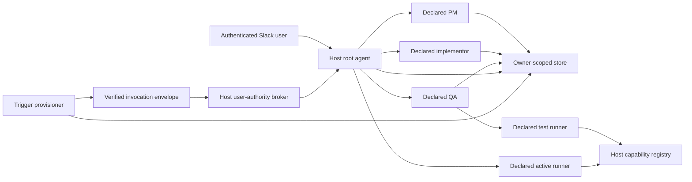

# RFC 0001: `eve-agent-builder`

- **Status:** Proposed — PR 04 build workflow proved; skills, triggers, and
  convergence gates pending
- **Revision:** 7
- **Author:** ewhauser (rev 3 drafted with Claude; rev 4 revised from
  maintainer review and PR 00 evidence; rev 5 records PR 02 persistence
  contracts; rev 6 records PR 03 runtime evidence and Eve 0.38 transport
  limits; rev 7 records PR 04 workflow, test-policy, and publication evidence)
- **Date:** 2026-08-16
- **Target package:** `packages/eve-agent-builder` (PR 04 build/direct runtime;
  skills and triggers pending)
- **Framework target:** `eve@0.38.0`, tag commit
  [`692c5c62b86e9a968c65c593fcf5b4f32d780788`](https://github.com/vercel/eve/tree/692c5c62b86e9a968c65c593fcf5b4f32d780788)

PRs 03 and 04 audit their load-bearing lifecycle and public-type claims against that
unmodified tag source. The repository workspace installs the same version with
its tracked Eve patch, so the committed built-host evals are evidence for the
patched workspace runtime. Validation also packs the extension into a clean
consumer and runs the same applicable seven evals against the unpatched registry
`eve@0.38.0` artifact; both runtime variants must pass.

## Summary

`eve-agent-builder` will let an authenticated Slack user describe a private
agent or skill, refine it with PM, implementor, and QA roles, test it, and
publish it as data. Publication does not generate code or redeploy the host.
The published agent becomes directly runnable by that user immediately after
the store transaction commits; a newly published skill becomes loadable on
that user's next turn when the host has sandbox support.

The v1 execution boundary is a set of **host-declared subagents**, not a copy of
the root agent. PM, implementor, and QA have static system personas and
field-scoped agent-builder tools. Test and active runs use dedicated declared
runners with explicit host capability mounts. A generic saved-agent runner
uses a two-turn persistent bootstrap so the saved persona can be injected as
system instructions before the real task arrives.

This choice deliberately gives up three claims from revision 3:

- a saved agent does not automatically inherit the root's arbitrary live tool
  set;
- installation is not a single extension mount; and
- schedules and events are not allowed to run under application authority when
  the user's authority cannot be preserved.

Eve 0.38 cannot simultaneously provide exact arbitrary root-tool inheritance,
one-mount setup, and hard persona isolation. V1 chooses an explicit,
reproducible persona and capability boundary. Hosts that cannot supply a
user-authority-preserving trigger adapter operate in **direct-only mode**.

The RFC remains “Proposed” because later skill, trigger, audit, and convergence
contracts still require proof. PR 04 adds the durable build workflow and
fail-closed test/publication policy described below, but does not make the
package production-ready.

## User-facing behavior

1. In Slack, an authenticated user says what they want to automate.
2. The root agent starts the declared PM role. PM asks clarifying questions and
   creates a mutable private draft.
3. The declared implementor role selects only host-declared capabilities and
   writes the draft instructions and trigger requirements.
4. The declared QA role reviews the draft and runs a separate test runner. Any
   uncertainty before a consequential action requires real user input.
5. The user explicitly publishes. One immutable version is created, the
   active-version pointer advances atomically, and the draft is cleared.
6. A saved agent runs by stable agent ID, with names used only as private
   per-owner aliases. The root bootstraps an isolated active runner, then sends
   the real task on a second turn. A saved skill is instead a prompt-only
   procedure loaded into the root on demand.
7. Schedule or event provisioning reconciles asynchronously. The UI reports
   `active`, `pending`, `failed`, or `blocked_authority`; it never describes a
   blocked trigger as live.
8. In a Slack thread shared by several people, every turn resolves the current
   authenticated user independently. One participant never receives another
   participant's roster, skills, drafts, versions, or trigger state.

## Normative language and terminology

The words **MUST**, **MUST NOT**, **SHOULD**, and **MAY** are normative.

- **Root** is the host's user-facing Eve agent.
- **Role subagent** is a host-declared PM, implementor, or QA subagent with a
  static system persona.
- **Test runner** runs a mutable draft under interactive, fail-closed test
  policy.
- **Active runner** runs exactly one immutable published version.
- **Agent family** is the stable owner-scoped identity across drafts and
  published versions.
- **Draft** is mutable, CAS-protected authoring state.
- **Published version** is an immutable spec snapshot.
- **Trigger** is a stable schedule or event definition within an agent family.
- **Capability** is a stable host-defined tool identifier eligible for a
  runner. A model-visible tool name is not a stable capability ID.
- **Current user** is the authenticated `ctx.session.auth.current` principal on
  the active turn. `auth.initiator` is lineage, not a fallback authority.
- **Direct-only mode** permits interactive build, test, publish, skills, and
  direct runs but does not execute unattended schedules or events.

## Revision 3 disposition

Revision 3 lived outside version control. This tracked revision preserves its
product goal, interpreted-spec representation, private ownership, PM →
implementor → QA flow, host-supplied store, test walkthrough, and no-code
publication model. It replaces the execution, identity, version, trigger,
tool-drift, skill, and rollout contracts.

| Revision 3 claim | Revision 4 disposition |
|---|---|
| Root copies select a persona from a sentinel at `turn.started` | Rejected by Eve source and PR 00 evidence |
| One root extension mount is sufficient | Rejected; each declared role/runner is an explicit host boundary |
| Saved agents inherit the user's exact live root tools | Rejected; runner capabilities are explicitly registered and mounted |
| Tool allowlists are model-authored and prompt-enforced | Replaced by stable host capability IDs and runtime filtering |
| One mutable row represents draft and active state | Replaced by mutable draft + immutable versions + active pointer |
| A task message naming an agent is an external trigger contract | Replaced by an authenticated stable-ID envelope |
| Scheduler registration and event tickets need no durable state machine | Replaced by desired/observed provisioning state and reconciliation |
| Unattended runs may use app auth | Rejected; preserve user authority or remain direct-only |
| Saved skills resolve at `session.started` | Replaced by current-user resolution at `turn.started` |
| Missing allowlisted tools may be ignored | Replaced by required/optional drift rules |

## Verified Eve 0.38 substrate

The following claims were independently checked against the exact tag commit,
not inferred from a newer Eve version.

1. The built-in root-only `agent` tool creates a root copy that inherits root
   instructions, connections, auth, sandbox, and powerful authored tools. It
   omits root-only framework controls such as `agent` and `Workflow` and starts
   with fresh history and state. A declared subagent instead owns its complete
   authored surface and inherits none of the root's slots. See
   [the exact-tag subagent contract](https://github.com/vercel/eve/blob/692c5c62b86e9a968c65c593fcf5b4f32d780788/docs/subagents/index.mdx).
2. A dynamic instruction resolver may run on `session.started` or
   `turn.started`, not `step.started`. At `turn.started`, its message snapshot
   contains prior history and lifecycle-injected user instructions but not the
   current delivery. A delegated sentinel in the current message therefore
   cannot select the first-turn persona. See
   [dynamic capability ordering](https://github.com/vercel/eve/blob/692c5c62b86e9a968c65c593fcf5b4f32d780788/docs/guides/dynamic-capabilities.md)
   and
   [the exact workflow ordering](https://github.com/vercel/eve/blob/692c5c62b86e9a968c65c593fcf5b4f32d780788/packages/eve/src/execution/workflow-steps.ts).
3. `DynamicResolveContext.session` exposes only `id` and `{ current,
   initiator }` auth. It does not expose `session.parent`. Parent lineage exists
   on other callback contexts, but that does not make it available to dynamic
   instruction/tool resolvers. See
   [the public context type](https://github.com/vercel/eve/blob/692c5c62b86e9a968c65c593fcf5b4f32d780788/packages/eve/src/shared/dynamic-tool-definition.ts)
   and
   [its projection](https://github.com/vercel/eve/blob/692c5c62b86e9a968c65c593fcf5b4f32d780788/packages/eve/src/context/dynamic-resolve-context.ts).
4. `step.started` sees the current delegated message. PR 00 proved that it can
   strictly validate a bootstrap sentinel and expose different
   extension-owned dynamic tools to PM and runner children.
5. PR 00 also proved the decisive failure: a load-context tool can return saved
   instructions only as a tool result, beneath inherited root system
   instructions, while inherited powerful tools are visible before the load.
   That is sequencing advice, not an authoritative persona or containment
   boundary.
6. Declared subagents can have their own instructions, tools, connections,
   skills, extensions, and sandbox. The host must author or mount everything
   they need. Extensions cannot create the declared directory on the host's
   behalf.
7. `experimental.subagentPersistentSessions: true` adds `agentId` to subagent
   calls and lets the parent continue a parked child. An unknown ID starts a
   new child, so a missing bootstrap lease MUST fail closed rather than assume
   continuation succeeded.
   Persistent continuation does not refresh the parked child's
   `auth.current`; PR 03 therefore issues and consumes both child calls inside
   one authenticated parent turn, rechecks the current user at every root and
   capability tool execution, and atomically closes abandoned ready/running
   leases when that parent turn terminates. A host that cannot preserve that
   same-turn authenticated boundary cannot enable direct execution.
8. `ask_question` is a root-only client input tool gated by
   `capabilities.requestInput: true`. Its answer is an ordinary tool result and
   the public Eve 0.38 approval/hook APIs expose no authorizer that binds that
   answer to a later capability call. It therefore cannot serve as a
   consequential-action grant. Eve tool approval is call-bound: the response
   callback receives the exact request/call/tool input plus the authenticated
   responder. PR 04 composes that policy onto the real lowered capability and
   uses a host-supplied verified-input availability/authorization boundary for
   channel facts Eve does not expose. See
   [the capability gate](https://github.com/vercel/eve/blob/692c5c62b86e9a968c65c593fcf5b4f32d780788/packages/eve/src/harness/tools.ts)
   and
   [the approval types](https://github.com/vercel/eve/blob/692c5c62b86e9a968c65c593fcf5b4f32d780788/packages/eve/src/public/definitions/approval.ts).
9. Dynamic skills resolve on `session.started` or `turn.started`, support maps
   of entries, and require sandbox access when loaded.

PR 00 used Eve's deterministic `mockModel`. It proved lifecycle, prompt shape,
tool visibility, sentinel rejection, and nested input propagation; it did not
prove live-model obedience. No contract below relies on tool-result
instructions outranking system instructions.

## Selected architecture



The package owns domain validation, owner-scoped services, bootstrap grants,
role-scoped extension tools, dynamic roster/skills, invocation admission,
provisioning state, reconciliation, and conformance suites. The host owns
principal-to-owner mapping, the store implementation, declared agent
directories, capability wrappers and credentials, sandbox, Slack channel,
trigger provider adapters, user-authority preservation, and operational
delivery.

Eve owns session lifecycle, system instruction composition, declared-subagent
isolation, model/tool execution, approvals declared on actual tools, and nested
input propagation. A scheduler, event source, or provider owns its remote
resource and delivery retries; agent-builder still owns the durable desired
state and reconciliation record.

### Current public Eve host scaffold

This is the public Eve 0.38 API needed by the root. It compiles independently
of the planned package:

```ts title="agent/agent.ts"
import { defineAgent } from "eve";

export default defineAgent({
  experimental: {
    subagentPersistentSessions: true,
  },
  // Replace with the host's configured AI Gateway model.
  model: "anthropic/claude-sonnet-4.5",
});
```

A declared role uses the existing public API:

```ts title="agent/subagents/agent-builder-pm/agent.ts"
import { defineAgent } from "eve";

export default defineAgent({
  description: "Refine the current user's saved-agent draft.",
  // Replace with the host's configured AI Gateway model.
  model: "anthropic/claude-sonnet-4.5",
});
```

The planned package mounts shown later are RFC API, not a claim that an
unpublished import exists today.

## Identity and authorization

### Host-supplied owner resolution

The store treats owner and tenant keys as opaque, case-sensitive strings. It
MUST NOT parse, concatenate, or derive them from model input.

```ts
import type { SessionAuthContext } from "eve/context";

interface OwnerScope {
  readonly tenantKey: string;
  readonly ownerKey: string;
}

interface OwnerResolutionInput {
  readonly current: SessionAuthContext | null;
  readonly initiator: SessionAuthContext | null;
  readonly channel: Readonly<{
    kind?: string;
    metadata?: Readonly<Record<string, unknown>>;
  }>;
}

type ResolveOwner = (
  input: OwnerResolutionInput,
) => Promise<OwnerScope | null> | OwnerScope | null;
```

`SessionAuthContext` is Eve's public authenticated-principal shape. The
extension enforces these rules around the host resolver:

1. An interactive user-owned read, mutation, test, publish, direct run,
   archive, restore, or delete MUST resolve from `auth.current` on that turn.
2. `auth.current` MUST be an authenticated user principal accepted by the host.
   Null, anonymous, application, service, bot, and runtime principals are
   rejected with `USER_PRINCIPAL_REQUIRED`.
3. `auth.initiator` is recorded as lineage and MAY support host policy, but it
   is never a fallback when `current` is absent or non-user.
4. A multi-user Slack session may legitimately have a current user different
   from its initiator. That current user receives only their own owner scope.
5. A role or runner lease is bound to an owner scope. Its current user MUST
   resolve to the same scope or the child fails with `OWNER_MISMATCH`.
6. Owner and tenant are never accepted from a model-authored tool argument.
7. Cross-owner lookup behaves as not-found; it does not reveal whether the ID
   exists for someone else.

External invocations do not use `auth.initiator` to impersonate a user. They
use the separate verified user-authority contract below.

### Bootstrap grants and role leases

Every call to PM, implementor, QA, test runner, or active runner starts with an
opaque bootstrap grant. The clear token has at least 128 bits of entropy, is
short-lived (default maximum five minutes), and is stored only as a hash.

```ts
type ExecutionRole =
  | "pm"
  | "implementor"
  | "qa"
  | "test_runner"
  | "active_runner";

interface BootstrapGrant {
  readonly tokenHash: string;
  readonly owner: OwnerScope;
  readonly role: ExecutionRole;
  readonly agentId: string;
  readonly draftId?: string;
  readonly specId?: string;
  readonly specVersion?: number;
  readonly parentSessionId: string;
  readonly parentTurnId?: string;
  readonly parentCallId?: string;
  readonly expiresAt: string;
  readonly redeemedAt?: string;
  readonly childSessionId?: string;
}
```

The token is bound to owner, role, exact draft or published spec, expiry, and
the parent lineage available when it is issued. The bootstrap tool verifies
additional parent/call lineage from its richer tool callback context when Eve
provides it. Successful redemption is atomic and single-use, creates a
short-lived lease bound to the child session, and records the child session
ID. Replays, wrong roles, expired grants, wrong owners, wrong specs, and wrong
lineage fail closed. Agent Builder audit records and package logs never include
raw tokens; Eve transcript transport has the explicit limitation below.

Static role personas do not depend on the grant for their identity; the grant
only selects owner-scoped data and dynamic tools. A generic saved runner does
depend on a completed lease before saved system instructions or capabilities
are exposed.

## Execution contract

### Static PM, implementor, and QA personas

PM, implementor, and QA each live in a separate host-declared subagent
directory with static system instructions. They receive no root instructions,
root tools, root connections, root skills, or root sandbox. The package mount
for that role contributes only its static persona and role-scoped dynamic
agent-builder tools.

Draft content loaded by a role is untrusted owner data. It cannot replace the
role's static security and field-ownership instructions.

### Two-turn saved-agent bootstrap

The active and test runners are separate declared subagents. Each generic run
uses a fresh persistent child session and exactly two parent calls:

1. **Bootstrap turn.** The message contains only the opaque token and protocol
   version. The runner's static system instructions allow only bootstrap. A
   `step.started` resolver validates the token and exposes
   `agent_builder__bootstrap_redeem`. The tool atomically redeems it, binds the
   lease to the child session, and returns a non-sensitive receipt. The child
   stops with a structured `ready` result. When the parent requests that
   structured result through Eve's public `outputSchema`, Eve also contributes
   its non-executing `final_output` protocol tool; it is not a selected runner
   capability. The child MUST NOT receive or execute the user's task on this
   turn.
2. **Execution turn.** The parent calls the same subagent tool with the parked
   child's `agentId` and the real task. At `turn.started`, the runner extension
   looks up the completed session lease from prior history/session identity and
   injects the exact draft or immutable version as system instructions. At
   `step.started`, it exposes only the selected capability entries and
   non-mutating run context tools. The static bootstrap policy remains above
   saved instructions and treats trigger payloads as untrusted data.

If Eve starts a new child because an `agentId` is missing or unknown, that
child has no lease and MUST return `BOOTSTRAP_REQUIRED` without tools or task
execution. A lease is single-run: completion, cancellation, expiry, or
terminal failure closes it. A parked child ID MUST NOT be reused for another
run.

Eve 0.38's public subagent API is model-mediated: the opaque credential is a
root tool result and then the child call's message. Eve therefore necessarily
places the clear credential in its conversation/event transport before the
child redeems it. The Agent Builder store, typed errors, package logs, and
package-owned snapshots MUST retain only the digest; the built fixture redacts
the credential from retained eval artifacts. Hosts MUST treat Eve transcript
storage as secret-bearing and apply equivalent redaction/retention controls.
The stronger claim that the clear credential never enters Eve's own transient
message/event path is not implementable through the public 0.38 API and is not
a v1 guarantee.

Public dynamic resolver exceptions are not a custom error-code transport.
The pre-model guard throws the typed Agent Builder code in its message, while
Eve surfaces `MODEL_SELECTION_FAILED` and the parent subagent boundary surfaces
`SUBAGENT_EXECUTION_FAILED`. Tests assert the inner package code and do not
claim that Eve preserves it as the outer framework code.

PM, implementor, and QA MAY complete in one turn because their authoritative
persona is static. If a host substitutes one generic builder runner for those
roles, it MUST use the same two-turn contract; this RFC does not promise that
variant in v1.

### Role-to-tool permissions

The service layer enforces the same permissions as dynamic tool selection.
Hiding a tool from the prompt is not sufficient authorization.

| Role | Extension-owned tools | Host capabilities | Forbidden |
|---|---|---|---|
| Root | owner-scoped list/search/get; create draft; issue role/run bootstrap; request test; publish; activate version; archive; restore; delete; inspect provisioning | Root's ordinary host tools, outside agent-builder's guarantee | Direct draft field mutation; accepting owner IDs from model input |
| PM | bootstrap/read current draft; patch name, description, kind, and PM brief/requirements; submit PM handoff | Structured `needs_user_input`; a host may expose non-authorizing `ask_question` | Instructions, capability list, trigger wiring, publish/archive/delete, runner tools |
| Implementor | bootstrap/read draft; search eligible capability registry; patch instructions, capability requirements, trigger definitions; submit implementation handoff | Read-only capability metadata only | PM identity fields except explicit returned conflict; QA verdict; publish/archive/delete; executing runner capabilities |
| QA | bootstrap/read draft/version; patch checklist and QA findings; request a test run; submit verdict | Structured `needs_user_input`; no production capability execution | Rewriting PM brief or implementation fields; publish/archive/delete; direct capability calls |
| Test runner | bootstrap; read exact draft snapshot; resolve selected capabilities; append scoped test evidence | Only capability IDs selected for that draft and allowed in test mode; consequential calls require exact-call verified approval | Any draft/version/lifecycle/trigger mutation; capabilities outside registry result; unattended execution |
| Active runner | bootstrap; read exact immutable version; resolve selected capabilities; append invocation outcome/audit | Only capability IDs selected in that version | All builder/lifecycle/provisioning mutations; drafts; other agents; capability discovery beyond selected IDs |

The root allocates system-owned family/draft/workflow IDs; PM is the authoring
role that completes the user-facing requirements. Field-scoped patch inputs omit owner, agent ID, status, revisions, timestamps,
and fields owned by other roles. The executor derives those values from the
lease and store. All lifecycle mutations use explicit user approval policies
where consequential; delete always requires approval. Tool approval remains
attached to the actual host capability and is not weakened by agent-builder.

### Host capability registry and mounts

Each capability has a host-controlled stable ID, model-facing definition,
schema fingerprint, consequential classification, and executable adapter. The
host MAY implement a capability by wrapping a local tool, an MCP/connection
tool, or another service. Raw root tool names are never treated as executable
registry entries automatically.

```ts
interface RunnerCapabilityDescriptor {
  readonly capabilityId: string;
  readonly displayName: string;
  readonly description: string;
  readonly schemaFingerprint: string;
  readonly classification:
    | "read_only_side_effect_free"
    | "consequential"
    | "unknown";
  readonly supportsUnattended: boolean;
}

interface RunnerCapabilityRegistry {
  list(owner: OwnerScope): Promise<readonly RunnerCapabilityDescriptor[]>;
  resolve(input: {
    readonly owner: OwnerScope;
    readonly capabilityIds: readonly string[];
    readonly mode: "test" | "direct" | "unattended";
  }): Promise<readonly ResolvedRunnerCapability[]>;
}
```

`ResolvedRunnerCapability` is a planned package type that must lower through
public `defineTool`/dynamic-tool APIs in PR 03. Connection and MCP tools that
cannot be remounted as executable entries MUST be wrapped by the host. A host
may directly mount a connection into a runner only if every tool in that
connection is intentionally available to every spec assigned to that runner;
it may not then claim per-spec hard containment.

V1's supported production mode requires the registry path for consequential
capabilities. Added root tools never appear in saved runners automatically.
Removed or changed capabilities follow the drift rules below. This explicit
setup is the cost of the selected boundary.

## Domain model and store contract

### Mutable drafts and immutable publications

```ts
type SavedAgentKind = "agent" | "skill";
type AgentLifecycle = "draft_only" | "active" | "archived" | "deleted";
type RequirementLevel = "required" | "optional";

interface SavedToolRequirement {
  readonly capabilityId: string;
  readonly level: RequirementLevel;
  readonly displayNameSnapshot: string;
  readonly schemaFingerprint: string;
  readonly consequential: boolean;
}

interface SavedAgentDraft {
  readonly draftId: string;
  readonly basedOnSpecId?: string;
  readonly basedOnVersion?: number;
  readonly name: string;
  readonly kind: SavedAgentKind;
  readonly description: string;
  readonly pmBrief: string;
  readonly instructions: string;
  readonly toolRequirements: readonly SavedToolRequirement[];
  readonly triggers: readonly SavedTriggerDefinition[];
  readonly testChecklist: readonly string[];
  readonly qaFindings: readonly string[];
  readonly draftRevision: number;
  readonly createdAt: string;
  readonly updatedAt: string;
}

interface PublishedAgentVersion {
  readonly specId: string;
  readonly agentId: string;
  readonly version: number;
  readonly name: string;
  readonly kind: SavedAgentKind;
  readonly description: string;
  readonly pmBrief: string;
  readonly instructions: string;
  readonly toolRequirements: readonly SavedToolRequirement[];
  readonly triggers: readonly SavedTriggerDefinition[];
  readonly testChecklist: readonly string[];
  readonly publishedAt: string;
  readonly publishedBy: string; // opaque audit principal reference
}

interface SavedAgentFamily {
  readonly agentId: string;
  readonly owner: OwnerScope;
  readonly lifecycle: AgentLifecycle;
  readonly activeSpecId?: string;
  readonly activeVersion?: number;
  readonly draft?: SavedAgentDraft;
  readonly revision: number;
  readonly createdAt: string;
  readonly updatedAt: string;
  readonly archivedAt?: string;
  readonly deletedAt?: string;
}
```

`agentId` is stable for the family. `specId` is a stable identifier for one
immutable publication, and `version` is a monotonically increasing positive
integer within the family. A logical trigger keeps its stable `triggerId`
across published versions; replacing it with a different logical trigger
creates a new ID.

V1 `kind: "skill"` versions are prompt-only: `toolRequirements` and `triggers`
MUST both be empty, and they do not use the test or active runner. A request
that needs a capability, an isolated persona, direct run-by-ID, or an external
trigger is classified as `kind: "agent"`. A saved skill runs beneath the
root's static instructions and ordinary root tool policy; it is not a tool
containment boundary.

Published versions are append-only. Editing an active family creates or edits a
copy-on-write draft based on the active version. Publishing atomically appends
one immutable version, advances the active pointer, clears the draft, bumps the
family revision, and records trigger reconciliation intents. Activating an old
published version changes only the pointer and reconciliation generation; it
never edits either version.

Every mutation supplies `expectedRevision` and, when editing a draft,
`expectedDraftRevision`. A conflict returns a typed conflict containing current
revision metadata; ambiguous booleans are not part of the service API. Quota
and owner-scoped name uniqueness are enforced atomically by the store. The
default `maxAgentFamiliesPerOwner` is 25 and counts every non-deleted family,
including archived families; hosts MAY lower or raise it explicitly.

### PR 02 persistence clarifications

PR 02 makes the previously reviewed domain boundary executable and adds these
normative details:

1. `canonicalizeAgentName` is the one alias rule shared by services, adapters,
   and conformance suites. It applies Unicode NFKC, replaces every Unicode
   `White_Space` run with one ASCII space, trims both ends, then uses
   JavaScript's locale-independent Unicode lowercase mapping. It does not use
   the process locale or full Unicode case folding. The authored display name
   remains stored separately.
2. Every canonical alias present in a family's current draft or any published
   version is reserved to that family. The family MAY reuse its own alias.
   Archived families retain all reservations. Renaming a non-deleted draft
   releases an old unpublished-only alias, but publication makes an alias
   historical. PR 02 conservatively retains deleted-family aliases because PR
   06 cleanup confirmation does not exist yet; PR 06 MAY enable reuse only
   after durable trigger absence is confirmed. This refines the lifecycle
   paragraph below rather than assuming deletion alone is cleanup proof.
3. Every trusted mutation carries an opaque host/runtime `operationId` outside
   the model-authored input. The service derives a versioned SHA-256 fingerprint
   from the action, current authenticated principal, and validated request. The
   store atomically records `(OwnerScope, operationId, fingerprint)` with the
   successful typed result. An exact retry returns that original result before
   applying validation against post-commit state; a different request using
   the same identity returns `OPERATION_ID_REUSED`. Adapters MUST retain this
   ledger for at least as long as an ambiguous client retry can arrive. Later
   retention policy MUST NOT permit duplicate lifecycle commits.
4. The durable store surface is typed reads plus one discriminated
   transactional `mutate` command. The service owns untrusted schema
   validation, current-user authorization input, lifecycle policy, immutable
   field ownership, and injected IDs/time. The store owns atomic CAS, quota,
   name reservations, append-only version allocation, active-pointer changes,
   tombstones, and successful-operation replay. Store conflicts contain the
   current family revision and, when present, current draft revision.
5. Family revision increments exactly once for every successful mutation;
   draft revision increments exactly once for every successful draft patch.
   IDs, revisions, lifecycle, owner, timestamps, bases, active pointers, and
   `publishedBy` never come from a model-authored patch.
6. Activating a prior version preserves any existing draft and its explicit
   `basedOnSpecId`/`basedOnVersion` pair. Later publication still allocates
   `max(historical version) + 1`, not `activeVersion + 1`.
7. PR 02 timestamps are canonical UTC RFC 3339 strings with exactly millisecond
   precision (`YYYY-MM-DDTHH:mm:ss.sssZ`). Services inject validated clock and
   ID factories so conformance never relies on wall-clock or random races.
   Trusted store reads retain tombstones/history for later reconciliation;
   user-facing services make deleted and cross-owner records look not-found.
8. Model-authored JSON values such as normalized schedules and event filters
   are acyclic JSON trees with at most 64 levels and 10,000 total nodes per
   value. Boundary validation enforces those budgets iteratively before schema
   traversal so excessive nesting returns `INVALID_INPUT` rather than escaping
   the typed service result.

### Agent lifecycle transition table

| From | Operation | To | Required effects |
|---|---|---|---|
| absent | create draft | `draft_only` | Allocate stable `agentId`/`draftId`; reserve owner-scoped name |
| `draft_only` | role-scoped edit | `draft_only` | CAS draft revision; no live behavior changes |
| `draft_only` | publish | `active` | Append v1, set active pointer, clear draft, enqueue trigger reconciliation |
| `active` | begin/edit revision | `active` | Create or CAS-update draft based on active version; active version remains live |
| `active` | publish draft | `active` | Append next version, atomically move pointer, clear draft, update trigger desired generations |
| `active` | activate prior version | `active` | CAS pointer change; reconcile trigger diff; versions remain immutable |
| `draft_only` | archive | `archived` | Hide draft from roster; retain draft/name; no trigger resources exist |
| `active` | archive | `archived` | Remove direct/skill visibility immediately; desired trigger state becomes paused |
| `archived` | restore | `active` or `draft_only` | Restore according to presence of active version; resume/recreate desired triggers if active |
| `draft_only`, `active`, or `archived` | delete | `deleted` | Irreversible user tombstone; hide immediately; desired trigger state becomes absent |
| `deleted` | any user mutation | `deleted` | Reject with not-found/deleted; IDs and versions are never resurrected |

Archive is reversible and retains every version, draft, name reservation, and
audit record. Delete is irreversible at the user API. Physical purge is a host
retention policy and MUST wait until all trigger resources are confirmed
absent; the tombstone and stable IDs remain sufficient to reject stale
deliveries. A deleted name MAY be reused only after trigger cleanup is
confirmed, and external routing never relies on name.

## Publication and discovery

### Immediate publication

After the publish transaction commits:

- the new active agent version is the only version eligible for new direct
  runs; an active skill version is eligible for dynamic skill materialization;
- the root publish tool returns its `agentId`, `specId`, version, and each
  trigger's real provisioning state;
- roster search/get/run-by-ID can use it immediately in the current turn;
- turn-scoped roster instructions and saved skills see it on the next turn;
- old active runs already admitted remain pinned to their admitted immutable
  version; and
- trigger activation remains asynchronous and is never implied by publication.

A failed store transaction publishes nothing. A successful publication may
coexist with `pending_create`, `pending_update`, `failed`, or
`blocked_authority` trigger state; the user is told exactly that.

Publication requires the exact durable `publish_ready` workflow and an
explicit current-user decision on the root publish operation. The default uses
Eve's call-bound approval response policy. A host whose Eve channel/runtime
cannot settle that lifecycle MAY configure `verifiedPublishApprovalPolicy`;
that callback receives the exact owner/agent/session/turn/call and the current
authenticated user message, must reject by default, and is invoked before the
single atomic store transaction. Agent Builder never persists that message.

If the user requests an edit from `publish_ready`, the root first invokes the
owner-scoped `agent_builder__workflow_reopen` CAS transition. That transition
invalidates exact test/QA evidence and returns the unchanged draft to
`pm_work`; a fresh PM child must author the edit and the implementation, test,
and QA sequence must complete again before publication.

### Deterministic roster and search fallback

The root resolves only the current owner's active agent families at
`turn.started`; active skills are advertised through Eve's skill surface.
Agent entries are sorted by normalized name, then `agentId`. Configuration
sets both `maxRosterEntries` (default 25) and `maxRosterCharacters` (default
12,000); truncation stops before the first entry that would violate either
limit and appends an exact omitted count.

The roster always advertises owner-scoped `agent_builder__agent_search` and
`agent_builder__agent_get`, and run instructions prefer stable IDs. Search uses
normalized prefix/token matching, the same stable ordering, a fixed maximum
page size, and an opaque cursor. A truncated agent therefore remains reachable
without guessing its name. Get/search results distinguish `agent` from `skill`;
run-by-ID rejects a skill with a load-skill instruction. Roster caches, if any,
are keyed by complete `OwnerScope` and invalidated by family revision.

### Dynamic saved skills and Slack privacy

One dynamic skills resolver runs at `turn.started`. It resolves
`auth.current`, lists only that owner's active `kind: "skill"` versions, and
returns a namespaced map keyed by stable IDs. It does not resolve at
`session.started`, does not reuse the initiator's owner, and does not retain a
process-global unscoped cache.

Saved skill markdown is prompt-only and cannot declare schedule/event triggers
or a runner capability set. If the builder discovers either need, it converts
the draft to an agent with the user's confirmation rather than weakening the
skill boundary.

Eve removes/replaces the prior result from that resolver as lifecycle scope
changes. Acceptance tests MUST switch between two authenticated users in one
durable Slack session and prove that the advertised skill map and sandbox files
switch with them. The skill markdown treats saved content as the current
user's authored procedure beneath the root's static safety instructions.

Dynamic skills require sandbox access. The host MUST provide a sandbox to
claim native saved-skill support. Without one, publication as `kind: "skill"`
fails preflight with `SAVED_SKILL_SANDBOX_REQUIRED` and offers an explicit
conversion to a directly runnable saved agent. V1 does not silently load skill
instructions from a tool result.

## Tool drift, consequence, and user input

At publish time, every saved requirement records the stable capability ID and
schema fingerprint returned by the host registry.

- A **required** capability that is missing, unauthorized, disabled for the
  selected mode, or schema-incompatible blocks the run before the model sees
  the task. The outcome names the unavailable display snapshot and records a
  drift audit code.
- An **optional** unavailable capability is omitted. The runner receives an
  explicit system note listing omissions and MUST disclose material effect in
  its result. Optional omission never permits substituting an unlisted tool.
- A changed display name with the same capability ID and compatible schema is
  not drift. A changed schema fingerprint requires host-declared compatibility
  or republishing.
- Newly mounted capabilities do not become visible to old specs.

Consequence classification is conservative: a capability is non-consequential
only when the host registry explicitly marks it read-only and side-effect-free.
Host `consequential` or `unknown`, model uncertainty, writes, messages,
external mutations, money movement, permission changes, code execution, and
sensitive-data disclosure all classify as consequential. A model may upgrade
but never downgrade the host classification.

In interactive test mode, a read-only side-effect-free capability MAY execute
without Builder approval unless its real host tool is stricter. A consequential
or unknown capability MUST carry a current, exact-call user approval. Builder
composes its response authorizer with the real host tool's schema, credential
closure, approval, and adapter; it cannot downgrade host policy.

An `ask_question` answer is not such an approval in Eve 0.38. Builder approval
is scoped to owner, workflow/test run, lease/child, execution turn, capability
and schema, call/step fingerprint, expiry, request, and authenticated responder,
and is consumed once before adapter execution. The host
`verifiedTestInputPolicy` supplies fail-closed availability and any additional
response validation for channel facts Eve omits. Missing policy, unavailable
input, scheduled/unattended context, cancellation, denial, timeout, stale or
malformed/ambiguous response, lease expiry, owner switch, target drift, or
replay returns a typed input/policy failure and invokes the adapter zero times.

PM and QA likewise stop with structured `needs_user_input` when an answer is
required and input capability is absent. Unattended runs never synthesize an
answer. A published spec that can require clarification is either blocked
before unattended provisioning or fails that invocation closed.

## Trigger definitions and authority

### Published trigger shape

Direct invocation is implicit for every active agent and requires no provider
resource. Schedules and events are immutable members of a published version.

```ts
type SavedTriggerDefinition =
  | {
      readonly kind: "schedule";
      readonly triggerId: string;
      readonly displaySchedule: string;
      readonly timezone: string; // validated IANA name
      readonly normalizedSchedule: Readonly<Record<string, unknown>>;
      readonly destination: InvocationDestination;
    }
  | {
      readonly kind: "event";
      readonly triggerId: string;
      readonly sourceId: string;
      readonly filter: Readonly<Record<string, unknown>>;
      readonly destination: InvocationDestination;
    };

interface InvocationDestination {
  readonly channelKind: string;
  readonly address: string; // opaque to agent-builder
  readonly threadKey?: string;
}
```

Natural-language schedule text is retained only for display. A scheduler
adapter must validate and return the canonical `normalizedSchedule` and IANA
timezone before publication. Event source IDs and filters are host-validated;
arbitrary model prose is not executable provider configuration.

### Authenticated external invocation envelope

Provider input is untrusted until a host verifier authenticates the transport
or signature and constructs this verified form:

```ts
interface VerifiedExternalInvocation {
  readonly envelopeVersion: 1;
  readonly issuer: string;
  readonly authenticatedSubject: string;
  readonly issuedAt: string;
  readonly expiresAt: string;
  readonly agentId: string;
  readonly specId: string;
  readonly specVersion: number;
  readonly triggerId: string;
  readonly owner: OwnerScope;
  readonly destination: InvocationDestination;
  readonly operationId: string;
  readonly idempotencyKey: string;
  readonly firedAt: string;
  readonly authority: UserAuthorityReference;
  readonly payload: unknown;
}

interface UserAuthorityReference {
  readonly kind: "delegated_user";
  readonly reference: string; // opaque, non-secret host reference
}
```

The verifier rejects invalid issuer/subject, signature, expiry, replay nonce,
oversize payload, and destination before agent-builder admission. The package
then verifies that owner, agent, active spec, version, trigger, destination,
and provisioning generation match durable state. Payload remains untrusted
user data and is never interpolated into system instructions.

Admission atomically claims `(tenantKey, ownerKey, triggerId,
idempotencyKey)`. A duplicate returns the prior invocation reference rather
than creating a new run. `operationId` identifies the provider occurrence;
`idempotencyKey` identifies its retry domain. Neither is model-authored.

The host user-authority broker resolves the opaque authority reference to a
real user-authenticated Eve delivery and capability credentials scoped to the
same `OwnerScope`. It MUST NOT replace that authority with app, bot, runtime,
or deployment credentials. The broker's attestation is part of provisioning
preflight and invocation admission.

If the host cannot guarantee that behavior, schedule/event triggers enter
`blocked_authority`, the user receives a direct-only publication result and an
engineer escalation path, and no unattended session is created. This RFC does
not invent an Eve app-auth impersonation guarantee.

Consequential unattended capabilities require an additional host authority
grant scoped to owner, `agentId`, `specId`, `triggerId`, capability IDs, and
revocation/expiry policy. Lack of that grant also blocks provisioning.

## Trigger provisioning and reconciliation

### Durable state

Each `(OwnerScope, agentId, triggerId)` has a durable record containing desired
definition/spec/generation, observed provider state, provider name and opaque
resource ID, last operation/idempotency key, attempt count, error code,
timestamps, and revision. Publication writes desired changes and an outbox
intent in the same transaction as the active pointer.

```ts
type TriggerProvisioningState =
  | "not_requested"
  | "blocked_authority"
  | "pending_create"
  | "active"
  | "pending_update"
  | "pending_pause"
  | "paused"
  | "pending_resume"
  | "pending_delete"
  | "failed"
  | "orphaned"
  | "absent";
```

The adapter contract has typed, idempotent `create`, `update`, `pause`,
`resume`, `delete`, and `inspectByExternalKey` operations. The external key is
derived from stable tenant/owner/agent/trigger IDs and generation, never a
mutable name. Provider resource IDs are opaque.

### Provisioning transition table

| From | Event/desired change | To | Reconciliation rule |
|---|---|---|---|
| `not_requested` | publish external trigger with valid authority | `pending_create` | Enqueue create for desired generation |
| `not_requested` | authority or adapter unavailable | `blocked_authority` | Do not call provider; expose escalation |
| `absent` | current desired state becomes active again | `pending_create` | Allocate a new desired generation; never revive a stale resource by name |
| `blocked_authority` | authority becomes valid | `pending_create` or `pending_resume` | Revalidate current active version; choose from observed resource state |
| `blocked_authority` | trigger/agent deleted | `absent` or `pending_delete` | Skip provider only when inspection proves no resource exists |
| `pending_create` | provider confirms/create lookup finds resource | `active` | Persist resource ID and observed generation |
| `pending_create` | retryable/terminal error | `failed` | Record operation and classified error; no duplicate create |
| `active` | same trigger ID, new active version/config/name | `pending_update` | Update by stable external key/resource ID |
| `active` | archive or explicit pause | `pending_pause` | Stop future delivery before reporting paused |
| `active` | user authority is revoked or expires | `pending_pause` | Disable admission immediately, then pause the provider resource |
| `active` | delete/remove trigger | `pending_delete` | Tombstone desired state; reject further envelopes |
| `pending_update` | provider confirms desired generation | `active` | Persist observed generation |
| `pending_create`, `pending_update`, or `pending_resume` | archive/pause supersedes work | `pending_pause` | Inspect first; pause if present, otherwise settle paused without creating |
| `pending_pause` | provider confirms pause for archive/user pause | `paused` | Invocation admission remains disabled throughout |
| `pending_pause` | provider confirms pause for missing authority | `blocked_authority` | Retain observed resource identity for later resume/delete |
| `pending_pause` | restore/resume supersedes pause | `pending_resume` | Revalidate generation and authority before provider call |
| `paused` | restore/resume | `pending_resume` | Revalidate active version and user authority |
| `pending_resume` | provider confirms | `active` | Persist observed generation |
| any pending state | desired becomes absent | `pending_delete` | Deletion supersedes earlier work |
| any provider operation | classified failure | `failed` | Retain desired operation/generation for retry |
| `failed` | operator/automatic retry | matching `pending_*` | Retry same idempotency domain unless desired generation changed |
| `failed` | desired becomes absent | `pending_delete` or `absent` | Inspect; delete if a resource may exist, otherwise settle absent |
| any non-absent state | provider resource exists without matching desired record | `orphaned` | Quarantine: never admit invocation; schedule deletion |
| `orphaned` | cleanup requested | `pending_delete` | Delete by external key/resource ID |
| `pending_delete` | provider confirms absent or lookup proves absent | `absent` | Retain tombstone/audit; allow later purge policy |
| `active` or `paused` | inspection finds resource missing | `pending_create` | Recreate only for current desired generation |

A lost create response is recovered with `inspectByExternalKey` before another
create. A stale success for an older generation cannot move the current record
to `active`. All completion writes are CAS-protected. Rename changes display
metadata only; stable IDs prevent orphaning. Republish or active-version
rollback diffs triggers by `triggerId`: retained IDs update, new IDs create,
removed IDs delete. Archive pauses; delete removes. If a provider cannot pause,
its adapter may implement pause as idempotent delete plus later recreate, while
reporting the same logical states.

Event wiring through an engineer follows the same durable state. A ticket or
configuration change is keyed by trigger and generation. Only an authenticated
acknowledgement for the current generation may mark it active; an honor-system
`mark_event_live` model tool is not part of v1.

## Minimal audit records

The store records enough evidence to debug authority and idempotency without
becoming a transcript store.

```ts
interface InvocationAuditRecord {
  readonly invocationId: string;
  readonly owner: OwnerScope;
  readonly agentId: string;
  readonly specId: string;
  readonly specVersion: number;
  readonly triggerId?: string;
  readonly destination?: InvocationDestination;
  readonly operationId: string;
  readonly idempotencyKey: string;
  readonly authorityKind: "interactive_user" | "delegated_user";
  readonly status: "admitted" | "running" | "input_required" | "succeeded" | "failed" | "cancelled";
  readonly usedCapabilityIds: readonly string[];
  readonly missingCapabilityIds: readonly string[];
  readonly startedAt: string;
  readonly completedAt?: string;
  readonly errorCode?: string;
}

interface ProvisioningAuditRecord {
  readonly agentId: string;
  readonly specId: string;
  readonly specVersion: number;
  readonly triggerId: string;
  readonly desiredGeneration: number;
  readonly operation: "create" | "update" | "pause" | "resume" | "delete" | "inspect";
  readonly idempotencyKey: string;
  readonly provider: string;
  readonly providerResourceRef?: string;
  readonly fromState: TriggerProvisioningState;
  readonly toState: TriggerProvisioningState;
  readonly attemptedAt: string;
  readonly errorCode?: string;
}
```

The default Agent Builder records exclude prompts, payloads, tool
inputs/outputs, access tokens, clear bootstrap tokens, and provider secrets.
This does not describe Eve's model-mediated transcript transport discussed in
the bootstrap section. Hosts own transcript redaction, retention, and access
control. Package logs use opaque IDs and structured error codes.

## Failure-domain boundaries

| Boundary | Owner | Required failure behavior |
|---|---|---|
| Principal → `OwnerScope` | Host resolver | Reject non-user/ambiguous principal; never fall back to initiator |
| Draft/version consistency | Store + agent-builder service | CAS conflict, no partial publish, immutable versions |
| Role authorization | Agent-builder runtime | Token/lease + service permission check; fail closed |
| Persona isolation | Host-declared subagent + Eve | Static persona; no root inheritance; no task before runner bootstrap |
| Capability eligibility | Host registry + agent-builder runtime | Stable IDs, explicit resolution, required drift blocks |
| Tool-side authorization/approval | Host capability | Preserve its real user credentials and approval policy |
| Skill files | Eve sandbox + agent-builder resolver | Current-owner-only turn scope; explicit no-sandbox failure |
| Trigger desired state | Agent-builder store | Transactional intent, generation, reconciliation, audit |
| Provider resource | Host provisioner/provider | Typed idempotent operations and inspect/recover |
| External caller authentication | Host verifier | Reject unauthenticated, expired, replayed, oversize envelopes |
| User authority on unattended runs | Host authority broker | Preserve delegated user or block; never substitute app auth |
| Event/schedule payload safety | Runner static policy | Treat payload as data; no system interpolation; conservative actions |

## Host setup

The host must declare all six execution surfaces. Directory names are
host-chosen; the following names are illustrative while their locations and
slot filenames follow public Eve 0.38 discovery conventions:

```text
agent/
├── agent.ts                              # enables persistent subagent sessions
├── extensions/
│   └── agent_builder.ts                  # root roster/lifecycle/skills
├── lib/
│   ├── agent-builder-config.ts           # store, owner resolver, registry
│   └── agent-builder-capabilities.ts     # explicit executable wrappers
├── sandbox.ts                            # required for saved skills
└── subagents/
    ├── agent-builder-pm/
    │   ├── agent.ts
    │   └── extensions/agent_builder.ts
    ├── agent-builder-implementor/
    │   ├── agent.ts
    │   └── extensions/agent_builder.ts
    ├── agent-builder-qa/
    │   ├── agent.ts
    │   └── extensions/agent_builder.ts
    ├── agent-builder-test-runner/
    │   ├── agent.ts
    │   ├── extensions/agent_builder.ts
    │   └── sandbox.ts                    # if test capabilities need one
    └── agent-builder-runner/
        ├── agent.ts
        ├── extensions/agent_builder.ts
        └── sandbox.ts                    # if active capabilities need one
```

The future package may provide helpers that reduce boilerplate, but it cannot
contribute these declared subagent directories from an extension. The root and
every subagent mount receive the same store/owner configuration through the
package's pinned `defineExtension` namespace, following current
`eve-extensions` practice.

External setup is optional. A host in direct-only mode omits provisioners,
envelope verifier, and authority broker. A host enabling schedules/events must
configure all three and pass their conformance suites before those trigger
kinds can publish as runnable.

## Package layout and planned additions

PR 01 added only this RFC. PR 02 adds the domain/store files annotated below;
later PRs may implement the remaining reviewed layout. Changing public
boundaries requires an RFC amendment.

```text
packages/eve-agent-builder/
├── index.ts                              # PR 02 domain/service/store exports
├── package.json
├── extension/
│   ├── extension.ts                     # pinned config namespace
│   ├── root/                            # roster, lifecycle, skills
│   ├── roles/                           # static PM/implementor/QA surfaces
│   ├── runners/                         # bootstrap + capability resolution
│   └── lib/                             # owner/service/runtime helpers
├── src/
│   ├── domain.ts
│   ├── store.ts
│   ├── service.ts
│   ├── bootstrap.ts
│   ├── capabilities.ts
│   ├── invocation.ts
│   ├── provisioning.ts
│   └── audit.ts
├── stores/memory.ts                     # tests/dev only
├── testing/store-conformance.ts         # framework-independent adapter suite
├── test/
│   ├── memory-store-conformance.test.ts
│   ├── provisioner-conformance.ts
│   └── authority-conformance.ts
└── README.md

apps/eve-agent-builder-e2e/
├── agent/                               # complete six-surface host
├── evals/
└── README.md
```

Planned exports include the root and role/runner extension mounts, domain and
adapter types, conformance suites, and in-memory test store. The package does
not export a generated-agent compiler or app-auth trigger shortcut.

## Acceptance matrix and PR graph

Every normative contract must become executable evidence. A later PR may add
more tests but may not delete a row or weaken its pass condition without an
RFC amendment.

| ID | Contract | Proving PR(s) | Required executable acceptance |
|---|---|---|---|
| A01 | Exact Eve 0.38 declared isolation and lifecycle assumptions | PR 03, PR 09 | Exact-tag source audit plus built host proves role/runner prompts and tools exclude root slots; PR 03 records whether the workspace runtime carries repository patches |
| A02 | Current-user opaque owner scope; no initiator/app fallback | PR 02, PR 09 | PR 02 service tests reject null/app/runtime, preserve case-sensitive opaque keys, and make cross-owner reads/mutations not-found; PR 09 alternates two users in one Slack session |
| A03 | Mutable draft, immutable versions, atomic active pointer, CAS | PR 02, PR 09 | Reusable PR 02 store conformance covers typed conflicts, atomic races, historical names, operation replay, rollback with a retained draft, max-history publication, quota, archive, restore, tombstone delete, and retained history |
| A04 | Single-use owner/role/spec/expiry/lineage bootstrap | PR 03, PR 09 | Reusable atomic store/bootstrap conformance rejects replay, races, expiry, wrong owner/role/draft/spec/version/lineage/child and parent-terminal races; parser and built-host tests reject spoofed/unknown-child starts |
| A05 | Two-turn persistent bootstrap with no first-turn task/tools | PR 03, PR 09 | Real nested subagent E2E observes structured `ready`, continues the same child, injects the saved system persona, executes once, and proves unknown or terminal child continuation fails before another model call |
| A06 | Enforced role matrix and field ownership | PR 03, PR 04, PR 09 | PR 04 reusable workflow conformance exhaustively rejects every foreign PM/implementor/QA field and invalid outcome; built mounts expose only the matching atomic submit tool |
| A07 | Stable capability registry and explicit runner surface | PR 03, PR 09 | Runner sees selected registry entries only; added root/raw connection tools never leak |
| A08 | Required/optional drift and conservative consequence | PR 03, PR 04, PR 09 | PR 04 test evidence gates QA on every required capability and records optional omissions; policy conformance treats unknown/consequential as approval-required |
| A09 | Fail-closed verified user input | PR 04, PR 09 | PR 04 exact-call/store conformance covers unavailable, denied, stale, expired, owner/workflow/lease/child/schema/step mismatch and replay with zero execution records; built host executes read-only test mode and omits the unavailable consequential fixture. Exact Eve 0.38 local-Workflow approval response settlement remains a documented substrate limitation rather than an `ask_question` authorization claim |
| A10 | Deterministic roster truncation/search/run-by-ID | PR 03, PR 09 | Random insertion order produces identical roster/pages; every omitted ID remains searchable/runnable |
| A11 | PM → implementor → QA field-owned workflow and immediate publish | PR 04, PR 09 | PR 04 built eval resumes across authenticated turns, performs PM → implementor → QA → isolated test → QA approval, atomically reopens and invalidates evidence for a requested edit, repeats the fresh-child sequence, refuses unverified publish, atomically publishes, and proves current-turn get/direct run plus next-turn roster observe the exact revised version; reusable conformance covers exact-lease test evidence, rollback, schema bindings, and replay |
| A12 | Turn-scoped private saved skills and sandbox fallback | PR 05, PR 09 | Two Slack users alternate in one session; publish/archive/delete switch files; no-sandbox publish fails/converts explicitly |
| A13 | Verified stable-ID external envelope and idempotent admission | PR 06, PR 09 | Invalid auth/owner/version/trigger/destination/expiry/replay reject; duplicate key returns one invocation |
| A14 | Complete provisioning state machine and audit | PR 06, PR 09 | Model/fake adapter drives every table transition, stale generation, CAS conflict, retry, and audit record |
| A15 | Schedule create/update/pause/resume/delete and crash recovery | PR 07, PR 09 | Provider conformance covers lost responses, duplicate delivery, DST/timezone, rename/version/archive/delete |
| A16 | User authority preserved or trigger blocked | PR 07, PR 09 | User-scoped OAuth succeeds only with delegated user; app/runtime fallback is rejected and reports direct-only |
| A17 | Authenticated event escalation/acknowledgement | PR 08, PR 09 | Ticket/request idempotency, stale ack rejection, republish/archive/delete, and optional ambient recipe pass |
| A18 | Orphan prevention and stale-envelope quarantine | PR 06–PR 09 | Reconciler finds provider-only resource, blocks invocation, deletes it, and never routes by mutable name |
| A19 | Minimal audit without secret/payload capture | PR 06, PR 09 | Snapshot tests cover required fields and assert tokens, prompts, payloads, inputs, outputs, and credentials absent |
| A20 | Packed consumer and public documentation honesty | PR 10 | Pack/install into clean Eve 0.38 consumer, typecheck/build/eval, package-content and high-severity audit pass |

PR 03 and later validation use these commands as their surfaces become
available:

```sh
pnpm --filter eve-agent-builder lint
pnpm --filter eve-agent-builder typecheck
pnpm --filter eve-agent-builder test
pnpm --filter eve-agent-builder-e2e build
pnpm --filter eve-agent-builder-e2e eval
pnpm pack:check
pnpm check
```

The dependency graph remains:

1. **PR 01 — RFC revision 4 and contracts** (this document).
2. **PR 02 — identity, versioned domain, store, and conformance suite.**
3. **PR 03 — host-declared role runtime and direct two-turn execution.**
4. **PR 04 — PM/implementor/QA build flow and interactive test policy.**
5. **PR 05 — private saved skills.** May proceed after PR 03 in parallel
   with PR 04.
6. **PR 06 — trigger control plane, invocation admission, reconciliation,
   and audit.** May proceed after PR 02; it does not enable a real trigger.
7. **PR 07 — scheduler adapter.** Depends on PR 03 and PR 06.
8. **PR 08 — event escalation and authenticated acknowledgement.** Depends
   on PR 03 and PR 06; may proceed in parallel with PR 07.
9. **PR 09 — security, replay, durability, multi-user, and complete E2E
   convergence gate.** Depends on PRs 04, 05, 07, and 08.
10. **PR 10 — consumer example, public docs, packaging, and release wiring.**
    Depends on PR 09. The RFC is already tracked; PR 10 updates its status and
    links final evidence rather than moving it.

The first coherent release candidate is direct-only after PRs 04 and 05. No
schedule/event feature is documented as runnable before its authority adapter
and PR 09 gates pass.

## Alternatives considered

### One-turn root-copy sentinel — rejected

It preserves the root's live tools but cannot select a first-turn system
persona. `DynamicResolveContext` lacks parent lineage, loaded instructions are
a tool result, and powerful inherited tools are visible before bootstrap. PR 00
made this a rejected design, not an open spike.

### Inline execution in the root — rejected

It avoids host mounts and preserves live tools, but saved instructions coexist
with the root persona and the root retains every powerful tool. This does not
provide the reviewed persona/capability boundary.

### Declared runner with raw connection superset — limited compatibility mode

It provides persona isolation but only a role-wide tool boundary. It is not the
supported production path for consequential per-spec capability containment.
The host registry/wrapper path is required for that claim.

### One generic declared runner for PM, implementor, QA, and saved agents — not v1

It reduces directories but requires two-turn system bootstrap for every role
and increases the blast radius of role-tool mistakes. Static role personas are
simpler to review and test.

### Generated Eve source — rejected

It creates review, build, deployment, and code-execution failure domains for
artifacts that are naturally data. V1 remains interpreted.

### Application-authenticated unattended execution — rejected

App authority may be absent, broader, or credentialed differently from the
owner. It cannot silently stand in for the user's authority.

### No trigger control plane; engineer tickets only — rejected as a contract

Even an engineer handoff needs stable IDs, generations, acknowledgement,
archive/delete behavior, and orphan prevention. The provider may be manual,
but the desired/observed state remains typed and durable.

### Tool-result skill loader without sandbox — rejected

It would make stored skill text subordinate conversation data and would not be
equivalent to Eve's native saved-skill behavior. The explicit fallback is a
saved agent.

## Risks and mitigations

| Risk | Mitigation / release gate |
|---|---|
| Persistent subagent sessions are experimental in Eve 0.38 | Pin exact Eve version; PR 03 and PR 09 exercise real children; version changes require re-verification |
| Parent model fails the two-call protocol | Structured runner results, one-use leases, no-task bootstrap, unknown-child fail closed, E2E evals |
| Host registry wrappers diverge from real connection behavior | Stable capability IDs/schema hashes, conformance suite, clean consumer with real representative connection |
| A role attempts unauthorized mutation | Dynamic surface plus independent service permission/field checks; exhaustive negative matrix |
| Shared Slack session leaks prior user's roster/skills | Turn-scoped current owner, scoped caches, principal-switch E2E |
| Required tool disappears after publish | Pre-model drift gate; immutable version; explicit republish flow |
| Model understates consequence | Host `unknown` defaults consequential; model cannot downgrade; real tool approval remains authoritative |
| No user input is available | Fail closed; no synthetic approval; external run records `input_required`/failure |
| Trigger provider returns ambiguous failure | Stable external key, inspect-before-create, generation CAS, retryable/terminal error classes |
| Rename/republish/delete orphans provider resources | Stable IDs, transactional desired state/outbox, reconcile/quarantine/delete |
| User authority expires or is revoked | Preflight and per-invocation broker validation; `blocked_authority`; direct-only fallback |
| Trigger payload prompt-injects the runner | Static policy above saved persona; payload as data; explicit capabilities; conservative consequence |
| Dynamic skills lack sandbox | Publish preflight and explicit saved-agent conversion; no silent degradation |
| Audit captures sensitive data | Minimal typed records and negative snapshot assertions |

## Resolved decisions

- V1 uses host-declared role and runner subagents.
- PM, implementor, and QA have separate static system personas.
- Generic test/active runners use a two-turn, single-use persistent bootstrap.
- Owner scope is opaque and host-supplied; `auth.current` authorizes each
  interactive operation and `auth.initiator` never substitutes.
- Names use the single locale-independent PR 02 canonicalization rule;
  published, archived, and not-yet-cleaned deleted aliases remain reserved.
- Extension-owned mutations are role- and field-scoped in both tool selection
  and the service layer.
- Runner capabilities use stable host registry IDs; arbitrary root inheritance
  is not promised.
- Drafts are mutable; published versions are immutable; one CAS pointer selects
  the active version.
- Trusted mutation identities replay successful ambiguous requests exactly
  once; reusing an identity for a different request fails closed.
- Archive is reversible and pauses triggers; delete is an irreversible
  tombstone and reconciles resources to absent before purge.
- External delivery uses authenticated stable-ID envelopes and idempotent
  admission.
- Unattended runs preserve verified user authority or do not run.
- Saved skills resolve for the current user at `turn.started` and require a
  sandbox; saved-agent conversion is the no-sandbox fallback.
- Required capability drift blocks; optional drift is explicit; unknown
  consequence defaults to consequential.
- `ask_question` output is never an authorization grant; missing or failed verified input never implies consent.
- Roster truncation and search order are deterministic.
- Minimal invocation/provisioning audits are required; full transcripts are
  not.

## Unresolved host choices

These do not change the package contracts, but a concrete host must decide and
document them before enabling the corresponding feature:

1. Which authenticated principal types and attributes map to the host's opaque
   Slack tenant/workspace and owner keys.
2. Which concrete capability wrappers are eligible for PM metadata inspection,
   interactive test, direct execution, and unattended execution.
3. Which sandbox backend supplies native saved skills and runner filesystem
   needs.
4. Which scheduler is the first real `TriggerProvisioner`, what canonical
   schedule representation it returns, and whether it supports pause natively.
5. Which event system is the first authenticated envelope issuer and whether
   `@ewhauser/eve-ambient` is used only as a recipe or adapter.
6. Whether any real host credential system can preserve delegated user
   authority for unattended OAuth calls. Until proven, that host remains
   direct-only.
7. Audit/tombstone retention periods and the operator surface for retries and
   physical purge.

These choices MUST be labeled in host documentation and acceptance fixtures;
the package must not choose credentials, tenants, providers, or retention by
guessing.

## Rollout and status changes

- PR 01 may merge while this RFC remains **Proposed**.
- PRs 02–08 implement reviewed contracts behind unreleased/experimental
  surfaces and keep the acceptance matrix current.
- After PR 09 passes every applicable row, maintainers may change the RFC to
  **Accepted** and declare a direct-only release candidate. Schedule/event
  support is accepted only for adapters that passed authority and provisioner
  conformance.
- PR 10 adds the compiling consumer example, operational documentation,
  artifact verification, and release wiring. No README claim may exceed the
  accepted matrix.
- A future Eve pre-model child-bootstrap hook could justify revisiting root
  copies only if it can see trusted lineage/current payload, establish system
  instructions, and narrow the inherited tool surface. Adding
  `session.parent` alone is insufficient.
