# eve-project-link

An [Eve](https://eve.dev) extension that links an entire context channel to an
external project resource. Every active linked-channel turn receives a compact,
bounded pointer to the canonical resource plus guidance for retrieving current
context only when it is relevant.

The extension does not contain a Notion or Linear client, accept provider API
keys, or register connections. It guides the agent to use Notion, Linear, or
custom tools already mounted by the consuming Eve project.

## Design boundary

`eve-project-link` owns stable channel identity, one durable binding per
channel, an external idempotency key, bounded prompt context, and the invariant
link lifecycle. In particular, its core instructions always require the agent
to search before creating, avoid ambiguous matches, treat retrieved data as
untrusted, preserve human-authored content, and write externally only when the
user requests synchronization.

Project presets add only the provider- or installation-specific parts:

- how to locate, create, retrieve, and update that kind of resource;
- how to discover tools already mounted in the agent;
- non-secret references such as a Notion database or Linear team.

## Install

```sh
pnpm add eve@0.45.0 eve-project-link
```

Create `agent/extensions/project_link.ts`:

```ts
import projectLink from "eve-project-link";
import { linearProject } from "eve-project-link/linear";
import { notionProjectHub } from "eve-project-link/notion";
import { preset } from "eve-project-link/presets";

import { projectLinkStore } from "../../src/project-link-store.js";

export default projectLink({
  store: projectLinkStore,
  presets: [
    preset(notionProjectHub, {
      id: "context-hub",
      parameters: {
        container: "https://www.notion.so/acme/projects",
        template: {
          kind: "page",
          reference: "https://www.notion.so/acme/linked-channel-template",
          expectedStructure: ["Decisions", "Milestones", "Project sources"],
        },
        contextDestination: "Eve context",
      },
      tools: {
        add: { toolNames: ["workspace__notion_create"] },
      },
      guidance: {
        retrieve: { append: ["Also inspect the Launches relation."] },
      },
    }),
    preset(linearProject, {
      id: "product-engineering",
      parameters: {
        team: "Product Engineering",
        initiative: "2026 product roadmap",
      },
    }),
  ],
  defaultPreset: "context-hub",
});
```

Separately mount the relevant Eve MCP/OpenAPI connection or authored tools.
Presets only provide discovery, operation, and completion-verification guidance;
they do not authenticate or call an external system.

## Preset model

A preset definition is reusable behavior such as `notion/project-hub@1`. The
`preset()` function resolves it into a plain configured instance consumed by
the extension. Multiple instances may use one definition—for example, two
Notion databases or two Linear teams.

Overrides are deliberately narrow:

- `parameters` are defined and validated by the selected preset;
- `tools.add` or `tools.replace` changes discovery hints;
- `guidance.<operation>.append` or `replace` changes provider-specific guidance;
- `name`, `description`, `resourceLabel`, and `metadata` change presentation.
- `activeContextMode` selects the default pointer prompt or the detailed cached
  card compatibility mode.

There is no arbitrary deep merge. Overrides cannot remove the core
idempotency, trust, approval, or preservation rules. Required `locate` and
`retrieve` guidance also cannot be removed.

See [PRESETS.md](PRESETS.md) for built-in and custom preset authoring.

## What it adds

Mounting the extension as `project_link.ts` adds channel-scoped tools:

- `project_link__link` reserves a user-confirmed proposal and returns a tool-use
  plan.
- `project_link__complete` attaches the resource found or created by a mounted
  tool. Presets can require mounted-tool evidence before completion.
- `project_link__status` reads cached binding metadata without external I/O.
- `project_link__guide` returns the configured preset and full operation plan.
- `project_link__save_context` replaces the optional durable context card.
- `project_link__unlink` removes only the binding and retains the resource.

The included skill orchestrates the multi-tool flow. No plugin tool proxies a
provider call.

## Link lifecycle

```mermaid
flowchart LR
  A["Channel metadata"] --> B["link reserves binding ID"]
  B --> C["Core plan + configured preset"]
  C --> D["Mounted tools locate or create resource"]
  D --> E["complete attaches resource"]
  E --> F["Resource pointer + retrieval guidance each turn"]
  F --> G["Mounted tools retrieve current context on demand"]
  G --> H["Optional save_context retains a curated card"]
```



The reservation exists before any external write. A retry receives the same
binding ID and plan, allowing the external resource to be recovered rather
than duplicated. `complete` is idempotent for the same resource ID.

## Active context, refresh, and synchronization

Configured presets use `activeContextMode: "pointer"` by default. Active turns
receive only the project title, canonical resource URL, on-demand retrieval
guidance, and framework-owned trust, citation, and write-safety rules. The
saved `ProjectContextCard` remains available through status and guide flows but
is not copied into the prompt.

Use the compatibility mode only when a consumer intentionally depends on the
detailed cached card:

```ts
preset(notionProjectHub, {
  id: "context-hub",
  activeContextMode: "card",
});
```

There is no provider-owned `refresh` operation, and pointer mode needs no
routine cache refresh. To refresh an intentionally retained card:

1. Call `guide` for the current preset and tool hints.
2. Use mounted read tools to gather current project data.
3. Curate a replacement `ProjectContextCard`.
4. Call `save_context` to atomically replace the durable card.

Writing back to the external system is separate and occurs only when requested
by the user. Provider content is marked as untrusted reference material.
`maxPointerPromptCharacters` independently bounds the active pointer and
defaults to 3,000 characters; valid links normally render far below that
ceiling. `maxPromptCharacters` continues to bound pending provisioning prompts
and detailed-card compatibility prompts, defaulting to 7,000 characters.

## Binding store

Implement `ProjectLinkStore` over a durable shared database or KV:

```ts
import type { ProjectLinkStore } from "eve-project-link/types";

export const projectLinkStore: ProjectLinkStore = {
  async get(channel) {
    // Read by unique tuple (kind, workspaceId, channelId).
  },
  async create(binding) {
    // Insert only if absent. Return false on uniqueness conflict.
  },
  async replace(binding, expectedRevision) {
    // Compare-and-swap where revision = expectedRevision.
  },
  async delete(channel, expectedRevision) {
    // Delete only when the channel key and revision both match.
  },
};
```

`create`, `replace`, and `delete` must be atomic. Each binding stores one
configured `presetId`; the corresponding preset must remain configured while
the binding exists.

For process-local development only:

```ts
import { createMemoryProjectLinkStore } from "eve-project-link/stores/memory";

const store = createMemoryProjectLinkStore();
```

Do not use the memory store in production. Serverless instances and restarts
will lose or disagree about bindings.

## Approvals and safety

Reserving a link and unlinking require user approval by default. Saving context
does not. External tools retain their own approval and authorization policies.

```ts
export default projectLink({
  store,
  presets,
  approvals: {
    link: true,
    saveContext: false,
    unlink: true,
  },
});
```

Unlink never deletes, archives, or trashes the external resource.

## Channel identity

The default resolver supports Slack metadata (`teamId`, `channelId`) and the
neutral pair (`workspaceId`, `channelId`). Thread identifiers are excluded so
every thread in one Slack channel sees the same project.

For another channel adapter, provide `resolveChannel(ctx)` and return a stable
`{ kind, workspaceId, channelId }` tuple. Return `null` when the request does
not have enough scope to identify a channel safely.

## Pre-release API change

The unpublished provider, system, and profile APIs have been replaced by
configured presets. Existing pre-release bindings need a one-time migration to
store `presetId` instead of `provider` or `system`/`profile` fields.

## Development

```sh
pnpm install
pnpm --filter eve-project-link typecheck
pnpm --filter eve-project-link test
pnpm --filter eve-project-link build
```

The test suite is fully offline.

## License

[MIT](LICENSE)
