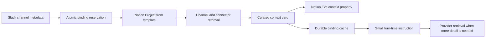

# eve-project-link

An [Eve](https://eve.dev) extension that links an entire context channel to an
external project hub. Every turn in a linked channel receives a compact,
durable project context card; deeper context remains available through the
provider and the host agent's retrieval tools.

The core is provider-neutral. This release includes a Notion adapter that
creates one Project page per channel from a known database template. A future
Linear adapter can implement the same `ProjectProvider` contract without
changing the channel tools, binding store, or prompt format.

## What it adds

Mounting the extension as `project_link.ts` adds channel-scoped tools:

- `project_link__link` creates or recovers the provider project and binds it to
  the current channel.
- `project_link__status` reads the cached binding without contacting Notion.
- `project_link__save_context` writes a curated context card to Notion and the
  prompt cache.
- `project_link__refresh` refreshes the prompt cache from Notion.
- `project_link__unlink` removes only the binding; it retains the Notion page.

The included skill teaches the agent to gather channel history, principals,
decisions, sources, milestones, meetings, open questions, and next steps after
linking. When the host makes a delegation tool available, that gathering can be
delegated to a bounded curator subagent; the resulting card is saved through
the same provider-neutral tool.

## Install

```sh
pnpm add eve@0.31.3 eve-project-link
```

Create `agent/extensions/project_link.ts`:

```ts
import projectLink from "eve-project-link";
import notionProjectProvider from "eve-project-link/notion";

import { projectLinkStore } from "../../src/project-link-store.js";

export default projectLink({
  store: projectLinkStore,
  providers: [
    notionProjectProvider({
      token: () => process.env.NOTION_TOKEN ?? null,
      projectsDataSourceId: process.env.NOTION_PROJECTS_DATA_SOURCE_ID!,
      projectTemplateId: process.env.NOTION_PROJECT_TEMPLATE_ID!,
      templateTimezone: "America/Denver",
    }),
  ],
  defaultProvider: "notion",
});
```

The Notion connection needs read and update content capabilities, and the
Projects database plus its template must be shared with that connection. Keep
the token outside agent messages and model-visible configuration.

For process-local development only:

```ts
import { createMemoryProjectLinkStore } from "eve-project-link/stores/memory";

const store = createMemoryProjectLinkStore();
```

Do not use the memory store in production. Serverless instances and restarts
will lose or disagree about bindings.

## Notion setup

Create or duplicate one workspace-level Context Hub. It has global Projects,
Decisions, People/Roles, Sources, Meetings, and Updates data sources. Configure
a database template in Projects whose linked views filter each related data
source to `Project contains This page`.

The adapter requires these Projects properties by default:

| Property | Type | Owner |
|---|---|---|
| `Name` | Title | Agent at link time |
| `Eve Link ID` | Rich text | Adapter idempotency key; do not edit |
| `Channel kind` | Rich text | Adapter |
| `Workspace ID` | Rich text | Adapter |
| `Channel ID` | Rich text | Adapter |
| `Channel URL` | URL | Adapter, when known |
| `Summary` | Rich text | Human-readable curated summary |
| `Eve context` | Rich text | Machine-readable context JSON; do not hand-edit |
| `Eve last synced` | Date | Adapter |
| `Status` | Status | Human or curator |

Property names are configurable through the Notion adapter's `properties`
option. See [NOTION_TEMPLATE.md](NOTION_TEMPLATE.md) for the complete database
blueprint and template layout.

Notion applies page templates asynchronously. `project_link__link` polls until
the new page has template content before activation. If creation succeeds but
the invocation is interrupted, retrying is safe: the adapter first queries
Projects by the stable `Eve Link ID` and reuses the page.

## The binding store

Implement `ProjectLinkStore` over a durable shared database or KV:

```ts
import type { ProjectLinkStore } from "eve-project-link/types";

export const projectLinkStore: ProjectLinkStore = {
  async get(channel) {
    // Read by the unique tuple (kind, workspaceId, channelId).
  },
  async create(binding) {
    // Insert only if absent. Return false on a uniqueness conflict.
  },
  async replace(binding, expectedRevision) {
    // Compare-and-swap where revision = expectedRevision.
  },
  async delete(channel, expectedRevision) {
    // Delete only where the channel key and revision both match.
  },
};
```

`create`, `replace`, and `delete` must be atomic. This prevents two concurrent
agent invocations from claiming different projects for one channel and
prevents a stale refresh from overwriting newer context.

## Context lifecycle



The context card is deliberately compact and structured. Provider content is
marked as untrusted reference material in the prompt, so instruction-shaped
text from Slack or Notion does not become agent policy. The default prompt
budget is 6,000 characters and can be changed with `maxContextCharacters`.
An abandoned `provisioning` reservation becomes recoverable after two minutes;
change that lease with `provisioningTimeoutMs` when provider creation routinely
takes longer.

## Provider contract

A provider implements three operations:

```ts
import type { ProjectProvider } from "eve-project-link/types";

const linear: ProjectProvider = {
  kind: "linear",
  async createProject(input, ctx) {
    // Idempotently create or find by input.bindingId.
  },
  async readContext(project, ctx) {
    // Return the provider-neutral ProjectContextCard, or null.
  },
  async writeContext(project, context, ctx) {
    // Persist the card in the external project system.
  },
};
```

The binding records only the provider kind and neutral external project
metadata. Provider-specific IDs may be stored in `ExternalProject.metadata`.

For a richer Notion hub, pass `readContext` to `notionProjectProvider`. It
receives the Project page plus an authenticated request helper, allowing it to
query the related Decisions, Meetings, Sources, and other data sources and
return one `ProjectContextCard`.

## Approvals and safety

Creating a project and unlinking require user approval by default. Saving a
context card does not, so an explicitly requested curation flow can complete
without repeated approval prompts. Override the defaults if needed:

```ts
export default projectLink({
  store,
  providers,
  approvals: {
    link: true,
    saveContext: true,
    unlink: true,
  },
});
```

Unlink never deletes or trashes the provider project. Deletion should be a
separate, provider-owned administrative workflow with its own confirmation and
retention policy.

## Channel identity

The default resolver supports Slack metadata (`teamId`, `channelId`) and the
neutral pair (`workspaceId`, `channelId`). Thread identifiers are deliberately
excluded so every thread in one Slack channel sees the same project.

For another channel adapter, provide `resolveChannel(ctx)` and return a stable
`{ kind, workspaceId, channelId }` tuple. Return `null` when the request does
not have enough scope to identify a channel safely.

## Development

From the monorepo root:

```sh
pnpm install
pnpm --filter eve-project-link typecheck
pnpm --filter eve-project-link test
pnpm --filter eve-project-link build
```

The test suite is fully offline.

## License

[MIT](LICENSE)
